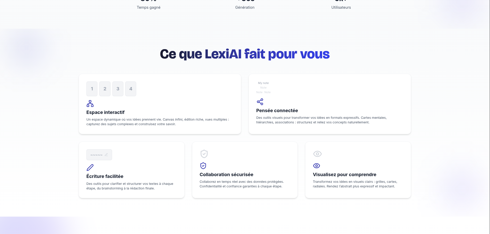
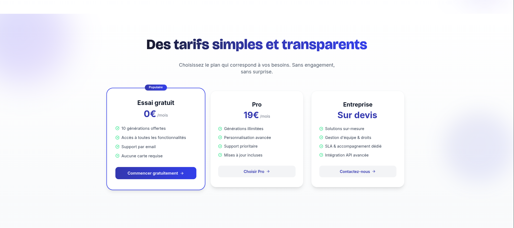
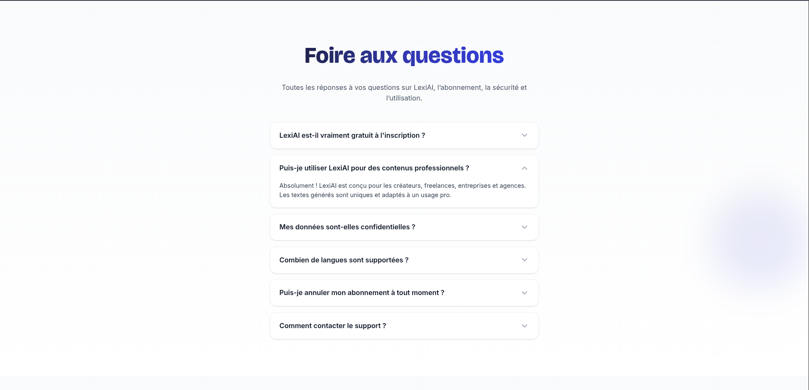

# Lexi AI


**Lexi AI** est une landing page moderne et animée, conçue autour d’un outil fictif d’écriture assistée par intelligence artificielle.

> Ce projet n’a pas vocation à être un produit complet, mais représente une vitrine personnelle mettant en avant un design épuré, une animation soignée et un travail d’intégration abouti.

---

## 🛠 Stack utilisée

- **React + TypeScript**
- **React Router**
- **Framer Motion** 
- **Lucide Icons**

---

## 📸 Aperçu du site

### Interface fonctionnalités



### Section pricing



### Section FAQ



### Section témoignages


---

## 🚀 Objectifs

- Travailler la composition d’une **landing page complète** avec :  
  Hero, Fonctionnalités, Démo, Cas d’usage, Avis, Pricing, FAQ, Footer.
- Intégrer **Framer Motion** pour des animations fluides.
- Reproduire le **style élégant et sobre** de sites comme Notion, Duolingo ou Figma.

---

## 📦 Installation locale

Pour lancer le projet en local :

```bash
# 1. Cloner le dépôt
git clone https://github.com/michel-DC/Lexi-AI.git

#2 Ouvrir le projet
cd lexi-ai

# 3. Installer les dépendances
pnpm install

# 4. Lancer le serveur de développement
pnpm dev
```
